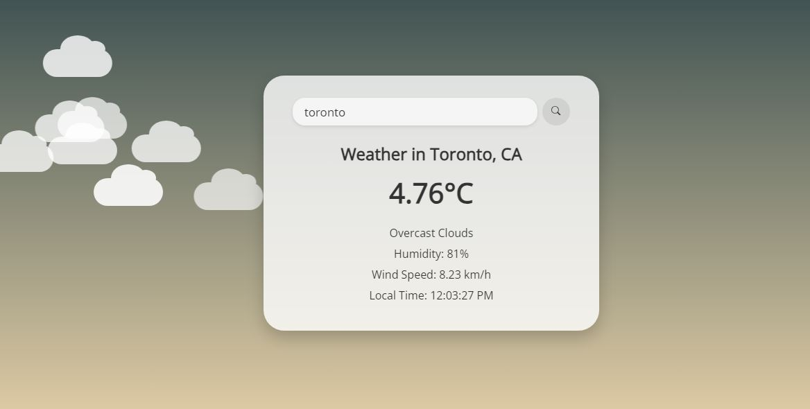

Weather App 🌦️https://dellahm.github.io/My-Weather-App/
A sleek, responsive weather application with dynamic animated backgrounds

Weather App Screenshot
Example: Weather in Toronto with misty conditions

Features ✨
✅ Real-Time Weather Data – Temperature, humidity, wind speed, and conditions (e.g., sunny, rainy)
✅ Dynamic Backgrounds – Animations change to match weather conditions (e.g., rain for "Rainy")
✅ Local Time Display – Shows the current time in the searched city
✅ Responsive Design – Works flawlessly on mobile and desktop
✅ Simple UI – Clean, intuitive interface with centered content

How It Works 🛠️
Search: Enter a city name (e.g., "Toronto").

Fetch: The app pulls data from OpenWeatherMap API.

Display: Shows temperature (°C), humidity, wind speed, and local time.

Animate: Background dynamically updates (e.g., sunny skies for clear weather).

Technologies Used 💻
Frontend: HTML5, CSS3 (with @keyframes animations), JavaScript

API: OpenWeatherMap (free tier)

Fonts: Google Fonts (Open Sans)

Setup & Installation 📦
Option 1: Run Locally
bash
Copy
git clone https://github.com/your-repo/weather-app.git
cd weather-app
open index.html  # Opens in default browser
Option 2: Deploy Online
Upload the files (index.html, style.css, script.js) to any static hosting service (e.g., Netlify, Vercel).

Customization 🎨
Colors: Modify gradients in style.css (e.g., .sunny background).

Animations: Adjust @keyframes timing in CSS.

Extend Features:

Add a 5-day forecast.

Toggle between °C/°F.

Browser Support 🌐
Chrome	Firefox	Safari	Edge
✔️	✔️	✔️	✔️
License 📜
Open source under MIT License.

Credits 🙌
Weather Data: OpenWeatherMap

Author: Dellah Miheso

Fonts: Google Fonts

Need Help? ❓
Contact: dellahmiheso@gmail.com
